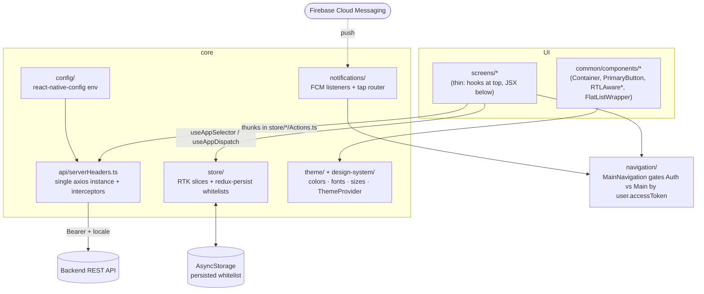

# React Native Magic

`@fadyshawky/react-native-magic` is a **plug-and-play React Native app template** published to npm
and consumed with:

```bash
npx @react-native-community/cli init MyApp --template @fadyshawky/react-native-magic
# optionally: --package-name com.yourcompany.yourapp
```

Use this skill as the map. The codebase has strong, consistent conventions; match the patterns that
already exist rather than inventing new ones. When the live code and `CLAUDE.md` / `docs/` disagree,
**the code wins** — and the "Gotchas" section below records the disagreements that matter.

## The two layers (know which one you're editing)

This repo is **not** a runnable app at its root — it is a template package with two distinct layers.
Before any change, ask: am I changing **how new projects are bootstrapped**, or **what the
bootstrapped app contains**? Most work is the latter.

| Layer | Where | What it is |
|---|---|---|
| **Template package** | repo root | The published npm package. `package.json` (name `@fadyshawky/react-native-magic`, `scripts.test` is a no-op `exit 0` — do **not** add a build step), `template.config.js`, and `scripts/askPackageName.js` (the post-init hook). |
| **The app** | `template/` | The actual RN app users receive. All app development, testing, and 95% of changes happen here. |

Default RN/runtime: **React Native 0.85.2, React 19.2.3, Node ≥ 20, TypeScript.** Key libs: Redux
Toolkit 2 + redux-persist, React Navigation 7 (native-stack + bottom-tabs), `@react-native-firebase`
24 (app/messaging/analytics), axios, `react-native-config`, `react-native-localization`,
`@shopify/flash-list`, `react-native-actions-sheet` + `@gorhom/bottom-sheet`, Reanimated 4 (worklets).

## App architecture (`template/src/`)

Layered: **UI** (screens, components) → **navigation** → **core** (store, api, theme, config,
notifications) + **common** (shared) + **design-system** (token re-exports).



| Folder | Purpose |
|---|---|
| `common/` | Shared components (`ErrorBoundary`, `NetworkBanner`, `SnackbarProvider`, `Container`, `PrimaryButton`, `PrimaryTextInput`, `RTLAwareText/View`, `FlatListWrapper`), localization (i18n + RTL), `helpers/`, `hooks/`, `urls/`, `utils/`, `validations/`. |
| `core/api/` | The **single** axios instance + interceptors, error extraction, response helpers. |
| `core/store/` | RTK slices per domain + redux-persist (AsyncStorage) with explicit whitelists. Typed hooks in `reduxHelpers.ts`. |
| `core/theme/` | `colors.ts`, `fonts.ts`, `commonSizes.ts`, `themes.ts`, `ThemeProvider.tsx`. Brand changes happen here only. |
| `core/config/` | `react-native-config` env access — the one place env flows through. |
| `core/notifications/` | FCM listeners + the single tap-routing extension point. |
| `design-system/` | Thin re-exports of theme tokens + `ThemeProvider`/`useTheme`. |
| `navigation/` | Navigator setup; token-gated Auth vs Main; `RootNavigation` ref for imperative nav. |
| `screens/` | Feature screens, each optionally with local `components/` and `hooks/`. Re-exported from `screens/index.tsx`. |
| `sheetManager/` | Action-sheet registration + type augmentation. |
| `types/` (repo `template/types/`) | Cross-cutting types & enums: `LoadState`, `ButtonType`, `AppEnvironment`, `IListState`, etc. |

## House coding style (match these patterns)

### Redux: the signature pattern

Slices do **not** use inline Immer-mutating reducers. They use **named handler functions** plus a
small `newState(state, patch)` helper that returns a shallow-merged copy. State shape and initial
value live in a separate `*State.ts`; async logic lives in `*Actions.ts` as `createAsyncThunk`s,
wired through `extraReducers`. Loading is tracked with the shared `LoadState` enum.

```ts
// store/user/userState.ts — shape + initial state + domain enums
export interface UserState { user: User; accessToken: string; refreshToken: string; /* … */ loginLoading: string; }
export const UserInitialState: UserState = { /* … */ loginLoading: LoadState.needLoad };

// store/user/userSlice.ts — named handlers + newState, NOT mutation
function loginHandler(state: UserState, action: PayloadAction<any>) {
  return newState(state, { accessToken: action.payload?.accessToken ?? state.accessToken, loginLoading: LoadState.allIsLoaded });
}
export const { reducer: UserReducer, actions } = createSlice({
  name: 'user',
  initialState: UserInitialState,
  reducers: { setLogout: () => UserInitialState, setTokens: setTokensHandler },
  extraReducers: b => b
    .addCase(userLogin.fulfilled, loginHandler)
    .addCase(userLogin.rejected, loginErrorHandler)
    .addCase(userLogin.pending, loginLoadingHandler),
});
export const { setLogout, setTokens } = actions;

// store/user/userActions.ts — thunk uses the api helpers + extractServerError
export const userLogin = createAsyncThunk('user/login', async (args, { rejectWithValue }) => {
  try { return handleFetchJsonResponse(await post({ url: '/login', data: { /* … */ } })); }
  catch (e) { const err = extractServerError(e); return rejectWithValue({ ...err, message: ensureString(err.message) }); }
});
```

Always use the typed hooks from `core/store/reduxHelpers.ts`: `useAppSelector`, `useAppDispatch`,
`createAppAsyncThunk`. Register every slice in `core/store/rootReducer.ts`. **If a field must survive
an app kill, add it to the matching `createWhitelistFilter('<domain>', [...])` in `store.tsx`** —
persistence is opt-in per field, and `serializableCheck` is disabled.

### API: one axios instance, four helpers

All network calls go through `core/api/serverHeaders.ts`, which exports `get`, `post`, `put`,
`deleteApi`, each taking `{ url, data?, config? }`. The request interceptor injects
`Authorization: Bearer <state.user.accessToken>` and `locale: <state.app.language>`. The response
interceptor: on **401**, dedups concurrent refreshes behind a single in-flight `refreshPromise`,
retries the original request once (`_retry` guard) with the new token; on refresh failure or **402**,
dispatches `setLogout()`. Auth endpoints (`/login`, `/auth/refresh`) bypass the retry. The
`refreshUserToken` thunk deliberately uses a **bare `axios.post`** (not the instance) so a failing
refresh can't recurse through the interceptor. **Never create a second axios instance** — extend the
helpers instead.

### Screens: thin, hooks-first, token-styled

Screens are named-function components (`export function Login(): JSX.Element`) re-exported from
`screens/index.tsx`. Hooks go at the top (`useAppDispatch`, `useAppSelector`,
`useNavigation<NativeStackNavigationProp<RootStackParamList>>()`, `useTranslation()`, `useRTL()`,
`useTheme()`, `useInputError(value, validatorFn)`); data/business logic lives in a screen-local
`hooks/useXData.ts`. Build UI from the shared components (`Container`, `PrimaryTextInput`,
`PrimaryButton` with `ButtonType`, `RTLAwareText/View`). Style with `StyleSheet.create`, pulling
spacing/sizes from `CommonSizes.spacing.*` / `CommonSizes.font.*`, colors from `theme.colors.*`, and
text styles from `theme.text.*` (e.g. `theme.text.header1`). Strings come from `t('key', 'namespace')`
— never hardcode user-facing copy.

### Lists, theming, notifications, i18n

- **Lists:** use `common/components/FlatListWrapper` (FlashList-backed). It maps `LoadState` to
  loading / empty / error (`TryAgain`) / pull-to-refresh states. Set `estimatedItemSize`. Don't
  reintroduce raw `FlatList` for heavy lists.
- **Theme/design-system:** `useTheme()` gives `{ theme, toggleTheme, setThemeMode }`. Both light and
  dark themes are defined in `themes.ts`. Change brand by editing `core/theme/{colors,fonts,commonSizes}.ts`
  only. `design-system/` just re-exports these tokens + the provider.
- **Notifications:** `index.js` registers `setBackgroundMessageHandler` **before**
  `AppRegistry.registerComponent` and queues the payload. `notificationService.ts` exposes
  `startPushNotificationListeners()` (mounted in `App.tsx`'s `ThemedApp` effect, returns cleanup) and
  a pending-route queue flushed once the user is logged in and the navigator is ready.
  **`routeFromNotificationData.ts` is the only place to extend tap-routing** — it reads `data.screen`
  + optional `data.params` (JSON string).
- **i18n/RTL:** `react-native-localization` with one namespaced file per area under
  `localization/translations/`, registered in `localization.ts`; the `Languages` enum is `en | ar`.
  `setLanguage()` also flips `I18nManager` RTL and the date locale. Access via `useTranslation()` →
  `t(key, namespace)` and `useRTL()`; wrap RTL-sensitive text/views in `RTLAwareText`/`RTLAwareView`.

## Gotchas — where the code disagrees with the docs (read before trusting CLAUDE.md)

These are the live realities. Each has bitten or will bite someone who follows the doc literally.

1. **Imports are relative, not aliased.** `babel.config.js`, `tsconfig.json`, and `jest.config.js`
   all define `@core`/`@common`/`@screens`/… aliases, but **`src/` uses zero of them** — every import
   is relative (`../../core/store/reduxHelpers`). `CLAUDE.md`/`docs` say to import from
   `@design-system`; the actual convention is relative paths. **Match the file you're editing**
   (relative today). If you ever switch to aliases, do it repo-wide, and remember all three configs
   must stay in sync.
2. **Fonts are Almarai** (an Arabic-friendly family), defined in `core/theme/fonts.ts`. The app is
   built RTL-capable; don't assume a Latin-only design.
3. **The app boots dark, and the i18n module default is Arabic — but the store default is English.**
   `App.tsx` sets `ThemeProvider initialTheme="dark"`; `localization.ts` sets
   `DEFAULT_LANGUAGE = Languages.ar`; yet `appInitialState` is `{ language: en, isRTL: false }`.
   Reconcile these deliberately when configuring a new app's defaults rather than assuming they agree.
4. **`home` is a stub.** `HomeScreen.tsx` returns `<></>`, and `screens/home/hooks/useHomeData.ts`
   selects `state.categories`, a slice that **isn't** in `rootReducer`. Treat home as a placeholder:
   create the `categories` slice (or rewrite the hook) before relying on it — don't assume it works.
5. **`config` exports `ENV`, not `ENVIRONMENT`.** `core/config/index.ts` reads
   `config.ENV || config.ENVIRONMENT` and exports `ENV` (plus `API_BASE_URL` and `enableRTL = true`,
   which is hardcoded, not a real toggle). The `.env` files use `ENVIRONMENT=`. Import `ENV`.
6. **`RootStackParamList` is a superset, not the source of truth for registered routes.**
   `navigation/types.ts` lists many routes (Home, Details, Categories…); the **actually registered**
   screens are Auth = `Splash/Login/OTP` and Tabs = `Main/Account`. Update the param list when adding
   a screen, but verify against the real `*Stack.tsx`.
7. **`navigate()` in `RootNavigation.tsx` is typed `name: never`** as a workaround — call it with a
   string screen name; don't be thrown by the signature.
8. **One axios instance, by design.** See the API section — the refresh path uses bare axios to avoid
   interceptor recursion. Adding instances breaks the refresh/logout contract.
9. **Reanimated 4 uses `react-native-worklets/plugin`** in `babel.config.js` — do **not** also add
   `react-native-reanimated/plugin`; they're mutually exclusive.
10. **`theme.colors` holds only the raw color-scale keys — semantic names are undefined.**
    `theme.colors` is `{...PrimaryColors, ...NaturalColors, ...AlertColors}`, so valid keys are scale
    names like `theme.colors.background_2`, `theme.colors.grayScale_0`, `theme.colors.PlatinateBlue_400`,
    `theme.colors.error_400`. The *semantic* names (`white`, `black`, `primary`, `tintColor`, `surface`,
    `card`, `background`, `red`, `shadow`) live in the internal `lightThemeColors`/`darkThemeColors`
    maps that are applied **only** to `theme.text.*` styles — they are **not** on `theme.colors`. So
    `theme.colors.primary` / `.white` / `.text` are `undefined` at runtime. Use a scale key, or pull a
    ready-made colored text style from `theme.text.*`.
11. **Firebase native config is not shipped.** `GoogleService-Info.plist` / `google-services.json`
    are added per project; see `docs/CUSTOMIZATION.md`.

## Common recipes

- **Add a screen:** create `screens/<Feature>/<Feature>.tsx` (+ local `components/`, `hooks/` as
  needed), re-export from `screens/index.tsx`, register in `AuthStack.tsx` or `MainStack.tsx`'s
  screen array, and add its route to `RootStackParamList`.
- **Add a Redux slice:** create `core/store/<domain>/{<domain>State.ts, <domain>Slice.ts,
  <domain>Actions.ts}` following the `newState`/named-handler/`LoadState` pattern; register it in
  `rootReducer.ts`; if it must persist, add a `createWhitelistFilter` entry in `store.tsx`.
- **Add an API call:** write a thunk in the domain's `*Actions.ts` using `get/post/put/deleteApi`,
  wrap in try/catch with `extractServerError` + `ensureString`, and handle lifecycle in the slice's
  `extraReducers`.
- **Add a language:** new file under `localization/translations/`, register it in `localization.ts`,
  extend the `Languages` enum.
- **Add an env key:** add it to `core/config/index.ts` and to **all four** env files
  (`.env`, `.env.development`, `.env.staging`, `.env.production`) plus `.env.example`, and to the
  `react-native-config` mock in `jest.setup.js` if tests touch it.

## Bootstrap layer (root package + scripts)

Touch these only when changing **how projects are generated**, not what the app contains.

- **`template.config.js`** declares `placeholderName: 'reactnativemagic'`, `titlePlaceholder`,
  `templateDir: './template'`, and `postInitScript: 'scripts/askPackageName.js'`.
- **`scripts/askPackageName.js`** runs in the *generated project's* cwd after init. If
  `--package-name` was passed (detected via the iOS bundle id already being set), it syncs
  `APP_ID`/`ANDROID_APP_ID`/`BUNDLE_ID` into the env files. Otherwise it prompts, then patches the iOS
  `project.pbxproj` (replacing the default `org.reactjs.native.example.$(PRODUCT_NAME…)`) and the env
  files.
- **`template/scripts/ci-sync-env.cjs`** writes/updates `KEY=value` pairs in an env file — used in CI
  to inject auto-incremented `ANDROID_VERSION_CODE` / `IOS_BUILD_NUMBER`, which Gradle and the iOS
  scheme then read via `react-native-config`.
- **Path-alias tri-sync:** any alias change must land in `babel.config.js` (module-resolver),
  `tsconfig.json` (paths), and `jest.config.js` (moduleNameMapper) together.
- **Husky v9 + lint-staged** are wired via the `prepare: husky` script; pre-commit runs `eslint --fix`
  + `prettier --write` on staged files.
- **Test a template change end-to-end** by generating from the local path:
  `npx @react-native-community/cli init TestApp --template file:/absolute/path/to/ReactNativeMagic`.

## Commands (run from `template/`)

```bash
npm start                          # Metro
npm run ios                        # iOS
npm run android:development:debug  # variants: development|staging|prod × debug|release
npm test                           # Jest          npm run typecheck   # tsc --noEmit
npm run lint                       # ESLint         cd ios && pod install
```

## How to use this skill

1. Decide which layer you're in (template package vs `template/` app) — almost always the app.
2. Find the closest existing example (a sibling slice, screen, or thunk) and mirror its structure,
   including its relative-import style.
3. For auth/token/persist/notifications/RTL work, re-read the relevant section above — those have
   load-bearing contracts (single axios + refresh dedup, persist whitelist, the tap router, RTL init).
4. When the code and `CLAUDE.md`/`docs` disagree, follow the code and the Gotchas section.
